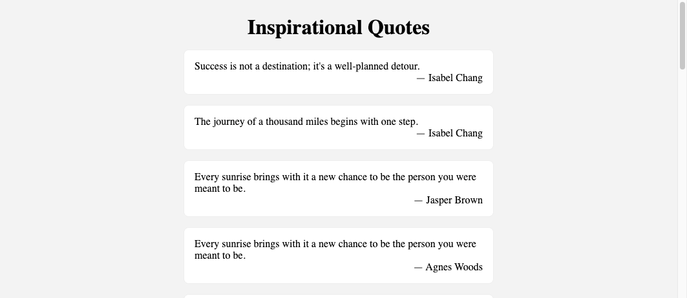

# Inspirational Quotes



One of your friends recently got a smart mirror, so as a weekend project, you decide to build an app that will show them inspirational quotes! Their morning routine has never before been so motivational!

## Instructions

1. Clone this repository down to your local machine and open it with VS Code. This will not be submitted.
2. Designate one person in your group to be the initial Driver. Everyone else will be a Navigator.
3. Read the code that has already been provided for you before starting the first prompt.

## Define state

1. Write a function `makeQuote` that returns an object with `sentence` and `author` properties. The values of those properties should be randomly chosen from the predefined `SENTENCES` and `AUTHORS` arrays.

> [!TIP]
>
> Use `Math.floor` and `Math.random` to generate a random index with which to access the array.

2. Use `makeQuote` to initialize the `quotes` state variable to be an array of `NUM_QUOTES` random quote objects. Use the console to confirm that `quotes` is initialized correctly.

Designate a new person to be the Driver before continuing to the next section.

## Create components

3. Complete the `QuoteCard` component. It takes a quote object as input and should return an HTML element with the following structure. The text content of the element should represent the input quote.
   ```html
   <figure class="quote">
     <blockquote>Sentence of the quote</blockquote>
     <figcaption>Author of the quote</figcaption>
   </figure>
   ```
4. Complete the `QuoteCards` component. It should return an `article` element with the class `quotes`. The article should contain each quote in state mapped to a `QuoteCard` as its children.

You should now have a web application that renders a list of randomly generates quotes!
