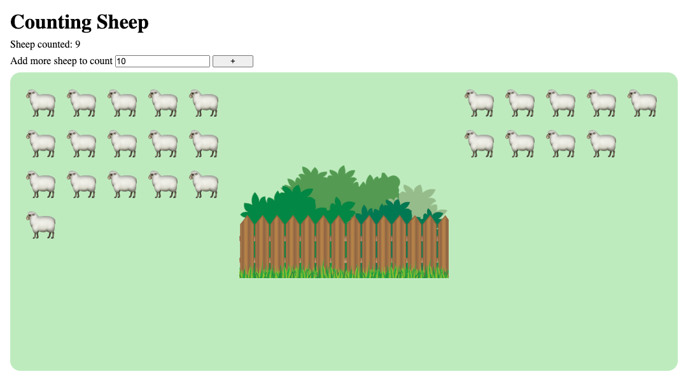

# Counting Sheep

You've been hit with a bout of insomnia, but you've heard that counting sheep can help people sleep. So, instead of sleeping, you spend the next few nights building a web application to help you count sheep!

## Instructions

1. Clone this repository down to your local machine and open it with VS Code. This will not be submitted.
2. Designate one person in your group to be the initial Driver. Everyone else will be a Navigator.
3. Read the existing code. A lot has already been provided for you so that you can focus on event-handling practice.

## Add sheep to count

First, let's implement the ability to add some sheep to count.

1. Complete `addSheep`. Remember to rerender the application!
2. Add a `submit` event listener to `SheepForm`.

   1. Prevent the page from refreshing on submission with `event.preventDefault()`.
   2. Get the value of the `count` key from the `FormData` of the `<form>`.
   3. Turn the count into a number, and then pass it into `addSheep`.

Once you've confirmed that you can use the form to add sheep to the starting pasture, designate a new person to be the Driver and continue to the next section.

## Count sheep

Next, allow users to click on a sheep to count it.

3. Complete `moveSheep`. It should update `count`, `start`, and `target` accordingly. Remember to rerender the application!
4. Add a `click` event listener to `Sheep`, but only if the sheep is waiting to be counted. This should move the sheep.
5. Build the `SheepCount` component. The text content of the returned element should reflect the `count` state.

You're done! You should now be able to click on a waiting sheep in the starting pasture to move it to the target pasture. You should also see the total number of sheep that have been counted so far.

## Extensions

If you have some extra time, try to build these additional features:

1. Add some input validation to `SheepForm`. Only allow positive integers to be passed to `addSheep`. Alert the user if they try to submit other inputs, such as strings or negative numbers.
2. Add a limit to the number of sheep that can be in the starting pasture. Prevent the user from adding more sheep if that would overcrowd the pasture.
3. Show a different message to the user depending on how many sheep have been counted so far.
