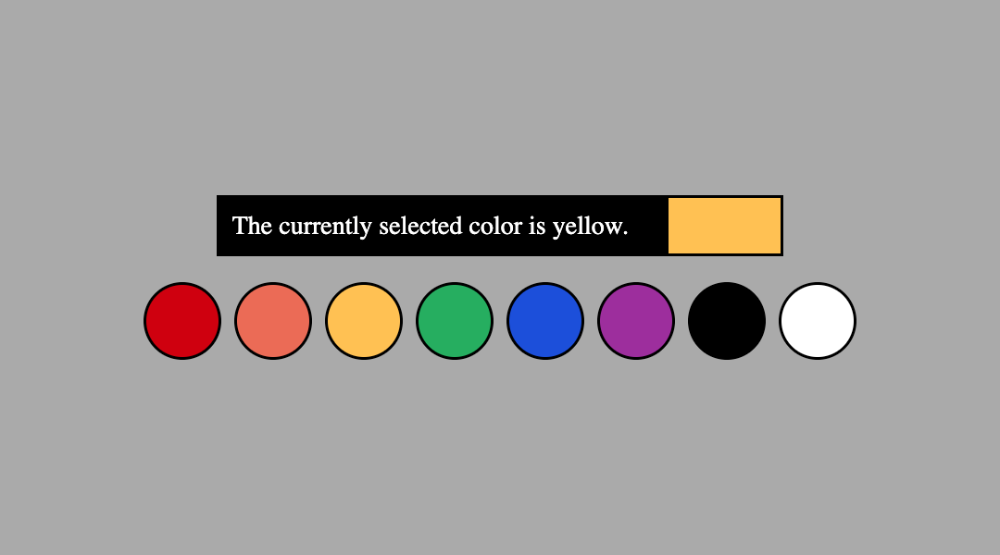

# Color Palette



In React, information is communicated down from a parent component to its children. If two components want to share information, that data must be **lifted up** to their nearest ancestor. We'll explore this process by building a simple color picker that allows users to select a color from a palette. The currently selected color is highlighted with a label.

This is a _pair-programming_ exercise, so designate one person in your group to be the initial Driver.

## Show the currently selected color

1. In `<App>`, create a `selectedColor` state variable with an initial value set to the first element in the `COLORS` array. The setter function should be named `setSelectedColor`.
2. In `src`, create a new file named `Highlighter.jsx`.
3. In that file, export a function component named `Highlighter`. It should return an element with the following structure. The CSS has already been written, so make sure you use the same class names!

   ```html
   <div className="highlighter">
     <div className="handle"></div>
     <div className="tip"></div>
   </div>
   ```

4. `<Highlighter>` should accept a single prop named `color`.
5. The "handle" should contain text indicating the value of the `color` prop. For example, if `color` is `"yellow"`, then the handle should display a message such as "The currently selected color is yellow."
6. The "tip" should have an additional class name that matches the `color` prop. This will apply the appropriate background color to the tip.
7. Back in `App.jsx`, import and render `<Highlighter>` within `<main>`. Pass the `selectedColor` state variable as the `color` prop.

If you've done everything correctly, you should now see a highlighter with a label indicating the currently selected color! Next, let's allow the user to change the color. Select a new person to be the Driver, then move on to the next section.

> [!TIP]
>
> What's the difference between `export` and `export default`? When you use `export`, you must _destructure_ the module using the _exact_ name you exported. When you use `export default`, you can import the module using any name you want (but usually the same name).
>
> ```js
> import Foo from "./Foo.jsx"; // export default
> import { Foo } from "./Foo.jsx"; // export
> ```

## Show a palette of colors

8. In `src`, create a new file named `Palette.jsx`.
9. In that file, export a function component named `Palette` that takes two props: `colors` and `setSelectedColor`. It should return a `<menu class="palette">`.
10. Inside the `<menu>`, map over the `colors` array and create a `<li>` for each color. Each `<li>` should have the following attributes:
    1. A `key` attribute set to the color
    2. Two classes: `swatch` and the color (e.g. `yellow`)
    3. An `onClick` event handler that calls `setSelectedColor` with the color as an argument
11. Back in `App.jsx`, import and render `<Palette>` within `<main>`, below `<Highlighter>`. Pass in `COLORS` as the `colors` prop and `setSelectedColor` as the `setSelectedColor` prop.

The app should now be fully working! You can click on any color swatch to change the currently selected color, which will be reflected in the highlighter. You've successfully lifted state up into `<App>` and shared it with both `<Highlighter>` and `<Palette>`.
