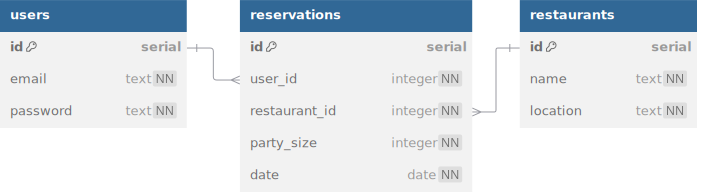

# Table4U

Table4U is a state-of-the-art restaurant-reservation service that allows customers to
easily make reservations for a table at a restaurant of their choice.



<details>
<summary>See DBML</summary>

```dbml
table users {
  id serial [pk]
  email text [unique, not null]
  password text [not null]
}

table reservations {
  id serial [pk]
  user_id integer [not null]
  restaurant_id integer [not null]
  party_size integer [not null]
  date date [not null]
}

table restaurants {
  id serial [pk]
  name text [not null]
  location text [not null]
}

Ref: users.id < reservations.user_id
Ref: restaurants.id < reservations.restaurant_id
```

</details>

## Initialize the database

The code has already been written for you. Your task is to read and understand it.
The following commands will create the database and seed it.

1. `createdb table4u`
2. Rename `example.env` to `.env` and update the `DATABASE_URL`.
3. `npm run db:reset`

## Hash user passwords

We use [bcrypt](https://github.com/kelektiv/node.bcrypt.js) to **hash** user passwords
before they are saved in the database.

4. What are the emails and passwords of the two user accounts created in `seed.js`?
5. How are the passwords actually stored in the `users` table? Use `psql` to check.
6. How many **salt** rounds are used to hash the password in `createUser()`?
7. What function does `getUserByEmailAndPassword()` use to compare a password with what's stored in the database?
8. What does `getUserByEmailAndPassword` return if either the email or password is
   incorrect?

## Create and verify JSON web tokens

Since we are building a RESTful API, clients need some way to authenticate themselves
every time they make a request. We will use [jsonwebtoken](https://github.com/auth0/node-jsonwebtoken)
to give clients a token that they can then attach in the headers of their requests.
This logic is stored in `utils/jwt.js`.

9. In your `.env` file, change the `JWT_SECRET` to something else. Anyone who knows
   this string will be able to create their own tokens! A good minimum length is 32
   characters. The `example.env` provides an example `JWT_SECRET`.
10. What input does `createToken()` take, and what does it return?
11. How long does a created token have until it expires?
12. What input does `verifyToken` take, and what does it return?

## Reuse middleware

Sometimes, we have logic that we want to reuse in multiple routes. Rather than
repeating that logic, we can extract it into a separate middleware function, which we
can then export and import as needed.

13. `requireBody()` is a higher-order function. What does it take as input, and what
    does it return?
14. What happens if the request is missing a body?
15. What happens if a request is missing any of the required fields?
16. What happens if a request provides all of the required fields in the body?

## Allow users to register and log in

We can now fit all the pieces together in the API routes that allow users to register
for an account or log in to an existing account! Take a look at the router in
`api/users.js`.

17. What does `POST /register` require a client to send in the request body?
18. What is used as the payload of the created token?
19. What response is sent back to the client on a successful request?

---

20. What does `POST /login` require a client to send in the request body?
21. What HTTP status code is sent if either the email or password is invalid?
22. What response is sent back to the client on a successful request?

## Get user from token

Our server is able to send tokens to clients, which they can then attach to their
requests. What does the server do when it receives a token? Let's find out in
`middleware/getUserFromToken.js`.

23. Which header does `getUserFromToken()` check?
24. What happens if a token is not attached to the request, or it's not a bearer token?
25. How does `getUserFromToken()` extract the token from the request headers?
26. What happens if an invalid token is attached to the request and `jsonwebtoken` is
    unable to extract a payload?
27. What happens if a valid token is attached to the request, but the payload does
    _not_ contain the ID of an existing user?
28. What happens if a valid token is attached to the request, and the payload _does_
    contain the ID of an existing user?
29. Why is it important that the app uses `getUserFromToken()` _before_ any of the
    routing middleware?

## Control endpoint access

The final step is to **authorize** access to different endpoints depending on the
user represented by the provided token. This is accomplished by the `requireUser` middleware.

30. What does `requireUser()` do if a user is _not_ attached to the request?
31. What does `requireUser()` do if a user _is_ attached to the request?

`requireUser` can be used in a few different ways. Let's take a look at some examples!

32. Where is `requireUser` used in the reservations router?
33. Can a client request any of the `/reservations` endpoints if they don't send a
    valid token? (_Hint_: middleware order matters!)
34. What does `GET /reservations` send?
35. What does `GET /reservations/:id` send if the client has a valid token but is not
    the one who made the reservation?

---

36. Who is allowed to request `GET /restaurants`?
37. Who is allowed to request `GET /restaurants/:id`?
38. How does the behavior of `GET /restaurants/:id` change if the client attaches a
    valid token?
39. Who is allowed to request `POST /restaurants/:id/reservations`?
40. What does `POST /restaurants/:id/reservations` require in the request body?
